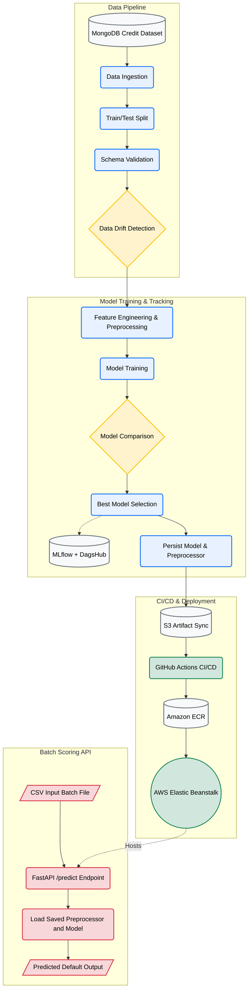

# Credit Risk Scoring API

An end-to-end machine learning pipeline for credit risk assessment and default prediction. The project ingests lending data from MongoDB, validates schema integrity, applies feature engineering, trains and compares multiple classification models, tracks experiments with MLflow and DagsHub, and exposes a FastAPI-based batch scoring service for inference.

## Overview

This solution is designed for a production-style MLOps workflow with the following goals:

- automate data ingestion from a MongoDB-backed source of credit records
- enforce data quality and drift monitoring before training
- transform and preprocess both numerical and categorical features consistently
- benchmark multiple models and select the best performer using a business-focused metric
- package the trained pipeline and expose it through a web API
- deploy the trained model as a containerized application on AWS


## Architecture Flow


## Workflow Summary

1. Data is loaded from MongoDB and stored as a feature dataset.
2. The raw dataset is split into training and test sets.
3. Schema validation checks required fields and numerical columns.
4. Data drift analysis compares the current distribution against the training distribution using the Kolmogorov-Smirnov test.
5. Feature transformation is applied with median imputation, standard scaling for numeric features, and custom Weight of Evidence encoding for categorical variables.
6. Multiple candidate models are evaluated, including Logistic Regression, Random Forest, and XGBoost.
7. The best-performing model is saved along with the fitted preprocessor for inference.
8. Model metrics and parameters are logged through MLflow and DagsHub.
9. The final artifacts are synchronized to S3 and deployed through the CI/CD workflow.
10. The FastAPI service accepts CSV files and returns prediction results in an HTML table.

## Key Features

- Automated end-to-end training pipeline
- MongoDB ingestion and feature-store export
- Schema validation for required columns and required feature types
- Drift monitoring using statistical checks
- Preprocessing pipeline for numeric and categorical features
- Weighted feature transformation using WoE encoding
- Model selection across multiple classifiers using GridSearchCV and F1-score optimization
- MLflow tracking with DagsHub integration
- AWS S3 artifact synchronization
- Dockerized deployment pipeline to Elastic Beanstalk
- FastAPI batch prediction service for credit default scoring

## Project Structure


```text
.
├── app.py
├── artifacts
│   └── 2026_09_02_23_38_52
│       ├── data_ingestion
│       │   ├── feature_store
│       │   │   └── data.csv
│       │   └── ingested
│       │       ├── test.csv
│       │       └── train.csv
│       ├── data_transformation
│       │   ├── transformed
│       │   │   ├── test.npy
│       │   │   └── train.npy
│       │   └── transformed_object
│       │       └── preprocessing.pkl
│       ├── data_validation
│       │   ├── drift_report
│       │   │   └── report.yaml
│       │   └── validated
│       │       ├── test.csv
│       │       └── train.csv
│       └── model_trainer
│           └── trained_model
│               └── model.pkl
├── credit_data
├── Dockerfile
├── final_model
│   ├── model.pkl
│   └── preprocessor.pkl
├── generate_batch_data.py
├── logs
│   
├── main.py
├── notebooks
│   ├── 01_data_sampling.ipynb
│   └── 02_eda.ipynb
├── prediction_output
│   └── output.csv
├── push_to_mongodb.py
├── raw_data
│   └── loan.csv
├── README.md
├── requirements.txt
├── schema
│   └── schema.yaml
├── setup.py
├── src
│   ├── components
│   │   ├── data_ingestion.py
│   │   ├── data_transformation.py
│   │   ├── data_validation.py
│   │   ├── __init__.py
│   │   ├── model_trainer.py
│   │ 
│   │      
│   ├── constants
│   │   ├── __init__.py
│   │
│   ├── entity
│   │   ├── artifact_entity.py
│   │   ├── config_entity.py
│   │   ├── __init__.py
│   │ 
│   ├── exception
│   │   ├── exception.py
│   │   ├── __init__.py
│   │  
│   ├── __init__.py
│   ├── logging
│   │   ├── __init__.py
│   │   ├── logger.py
│   │   
│   ├── pipeline
│   │   ├── __init__.py
│   │   ├── predict_pipeline.py
│   │   |
│   │   └── training_pipeline.py
│   |
│   └── utils
│       ├── __init__.py
│       ├── main_utils.py
│       ├── ml_utils
│       │   ├── classification_metric.py
│       │   ├── estimator.py
│       │   
│       |
│       ├── s3_syncer.py
│       └── woe_encoder.py
├── templates
│   └── table.html
└── test_batch.csv
```


## Technology Stack

- Python 3.10+
- Pandas, NumPy, SciPy
- Scikit-learn
- XGBoost, LightGBM, CatBoost
- FastAPI and Uvicorn
- MLflow and DagsHub
- MongoDB
- Docker
- AWS S3, ECR, and Elastic Beanstalk
- GitHub Actions

## Environment Setup

### Prerequisites

- Python 3.10 or later
- MongoDB instance or connection string
- AWS account with S3, ECR, and Elastic Beanstalk access
- DagsHub account for MLflow experiment tracking

### Clone the Repository

```bash
git clone https://github.com/your-username/CreditRiskScoring.git
cd CreditRiskScoring
```

### Create a Virtual Environment

```bash
python -m venv venv
source venv/bin/activate
```

On Windows:

```bash
venv\Scripts\activate
```

### Install Dependencies

```bash
pip install -r requirements.txt
```

### Configure Environment Variables

Create a `.env` file in the project root with the required variables, for example:

```env
MONGO_DB_URL=your_mongodb_connection_string
```

## Run the Training Pipeline

Execute the full ML workflow locally:

```bash
python main.py
```

This pipeline performs the following operations:

- data extraction from MongoDB
- train/test split
- schema validation
- drift detection
- preprocessing and feature transformation
- model training and selection
- artifact export and S3 syncing

## Run the API

Start the batch scoring API:

```bash
python app.py
```

Then open:

```text
http://localhost:8000/docs
```

### API Endpoints

- `GET /` redirects to the Swagger documentation
- `GET /train` starts the training workflow in the background
- `POST /predict` accepts a CSV file and returns prediction output

### Example Prediction Request

```bash
curl -X 'POST' 'http://localhost:8000/predict' \
  -F 'file=@test_batch.csv'
```

The service loads the saved preprocessor and model, generates predictions, writes the output to `prediction_output/output.csv`, and renders a preview table in the response.

## Deployment Architecture

The project is designed for cloud deployment on AWS using Docker and Elastic Beanstalk.

GitHub Actions orchestrates the deployment process:

1. code is checked out from the repository
2. validation steps are triggered
3. AWS credentials are configured
4. the latest model is downloaded from S3
5. a Docker image is built and pushed to Amazon ECR
6. the new image is deployed to Elastic Beanstalk

This setup allows trained models to be promoted into the service layer in a repeatable and production-oriented workflow.

## Model Strategy

The training process evaluates several candidate classifiers:

- Logistic Regression
- Random Forest Classifier
- XGBoost Classifier

The models are compared using F1-score, and the best-performing model is retained. A guardrail is also enforced to avoid severe overfitting or underfitting by comparing train-test score differences.

## License

This project is intended for educational and demonstration purposes. Update the licensing details according to your organization's requirements before production deployment.

## Conclusion

Credit Risk Scoring combines data engineering, statistical validation, feature transformation, model selection, and deployment automation into a cohesive MLOps workflow. The repository is structured to support local experimentation and cloud deployment while maintaining a clean separation between data processing, training, and inference responsibilities.
